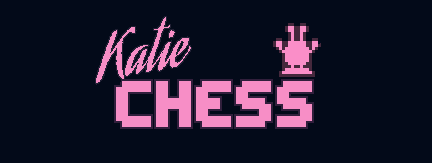
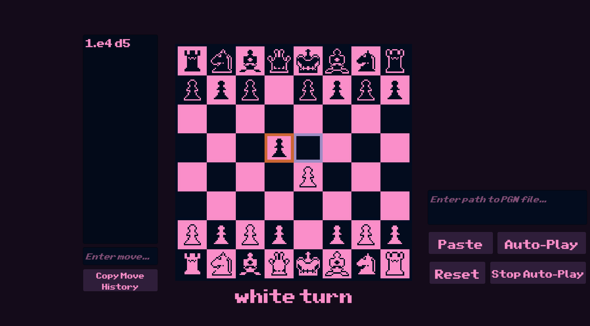
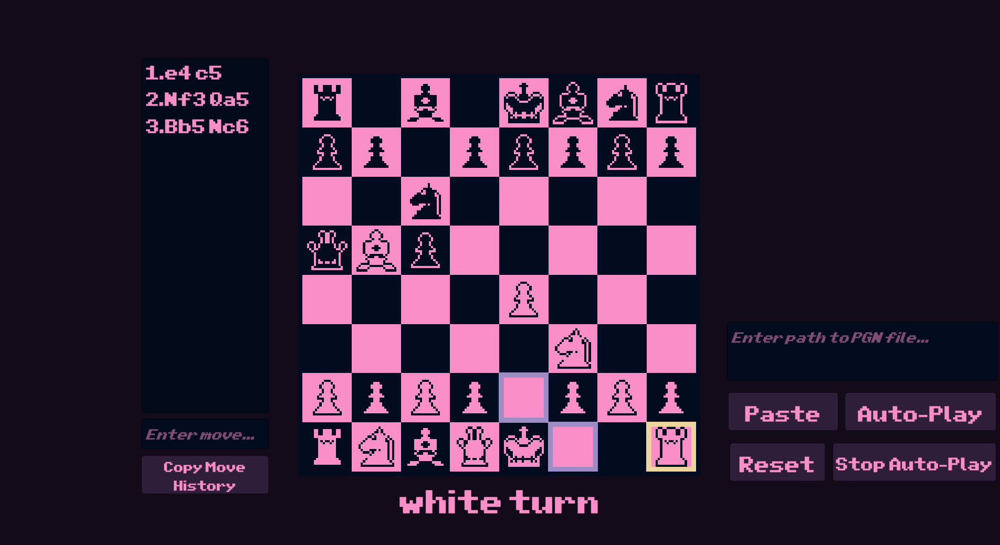
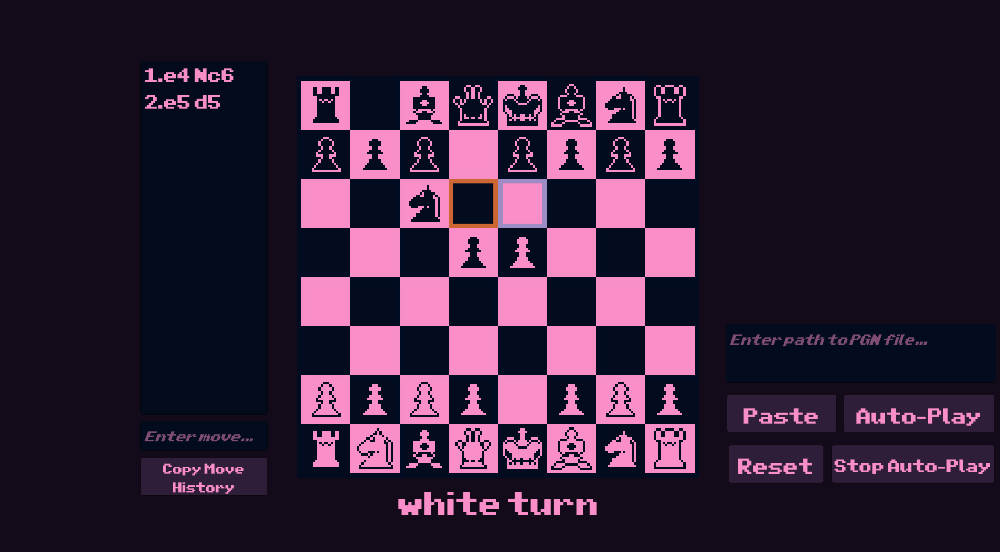

Katie chess is a project I created to get familar with scripting C# in Unity. It is basic chess with all your favorite moves including castling & en passant, and includes a couple extra cute features:
- Move either by clicking indicated spots OR using standard algebraic notation
- Load in your favorite chess games (often stored as *.pgn files, portable game notation, but it can be any text file) and watch your favorite chess game play out
- Copy move history to your clipboard to save it in a pgn file 

Please be aware that katie chess is not:
- A chess engine with any kind of AI
- An online chess game

This project is not in active development at this time.

# Screenshots & Videos

## Capturing

## Castling

## En Passant

# How to load in a game to autoplay

[ChessGames.com](https://www.chessgames.com/) has an impressive database of downloadable games as *.pgn files, but any text file with valid algebraic notation will work. You can type path of the .pgn file and paste in the textbox labeled `Enter path to pgn file...` OR you can copy the path and use the `Paste` button to populate that textbox with your clipboard contents. Then hit Auto-Play button.  If you would like to stop the automated moves you can use the `Stop Auto-Play` button. The `Reset` button will reset the board back to a new game position. This will delete the move history so copy that using the `Copy Move History` BEFORE hitting reset if you'd like.

If you are hurting for .pgn files, there is a Sample PGN folder enclosed with this executable with a few tested versions. Note the Byrne v Fischer game is suffering from the checkmate bug listed below.

# Known Bugs
- Checkmate Bug: Game may fail to recognize checkmate if king could capture a checking piece, but that capture would keep king in check. 
    - Future work would address this by replacing the MoveTable architecture with the more common board representation/threat map paradigm.
- .pgn file parsing is still a little too picky about formatting.
- Invalid move in pgn file doesn't automatically stop auto-play
- Sometimes it takes a couple tries to capture a piece by clicking
- Pawn promotion isn't available yet
- .pgn files with a lot of editorials in `{}` can cause errors (i.e. very well studied games like Robert Byrne vs. Bobby Fischer), but just a few comments should handled ok.
    - I think this is related to how lines 55 and 92 in `AutoPlayBehavior.cs` are both intended to remove annotaitons, and they are in two different methods, further confusing things.

# How is the code structured?
Described in [CodeDocs.md](docs/CodeDocs.md) to keep this readme friendly and a manageable length.

# Features to be added:
- Pawn promotion
- Loading .pgn files from dialog box instead of pasting a file path
- Saving .pgn files instead of copying to clipboard
- Computer opponent AI
