# Chess Code Documentation
Intellisense will give you inline documentation of all methods and properties. This document is intended to describe how unity uses these scripts together.

# Diagram Key

I personally don't find UML very compatible with how I think, so I have frankensteined my own workflow-oriented charts instead. 

## Connection Key


## Workflow Diagrams
I use subgraphs to describe how classes relate to each other in the [Workflows](#workflows)


## Class Description Diagrams
Then I also describe each class in more detail in [Class Descriptions](#class-descriptions) in individual diagrams.


# Workflows
## Starting a new game 
When a new game is started, the following actions occur


## Selecting a piece


## Making a Move via mouse


## Move using notation

```mermaid
    graph
    subgraph SubmitMove Game Object
    A{{"Submit.Text"}}
    end
    subgraph Game.cs
    Z1[["Update"]]-->Y1["MoveUsingNotation"]
    A1["MakeMove()"] --> B1["GetLocationStatus()"]
    C1["EndTurn()"]
    C1-->F1["GetPossibleMoves(other player)"]
    C1-.->D1["PutInCheck()"]
    C1-.->E1["Safe()"]
    C1 --> G1["StartTurn()"]
    Y1 .-> H1["UpdateTurnStatus()"]
    Y1 .-> A1
    end
    subgraph Chesspiece.cs
    A2["MoveMe()"] 
    end
    subgraph MoveTable.cs
    A3["CheckForCheck()"] 
    end
    Z{Awaiting User \nEntering Move Notation} -->Z1
    A-->Y1
    A1-->A2
    A2 --> C1
    C1-->A3

```


## Copy Move History
```{mermaid}
    graph
    Z{"Click \n 'Copy Move History' \n Buttdon"}
    subgraph CopyBehavior.cs
    A["OnButtonPress()"]
    end
    subgraph Game.cs
    A1["GetMoveHistoryAsString()"]
    end
    Z --> A
    A-->A1
    A1 --> Z2{"Put Move History\nin User's Clipboard"}

```

## Paste PGN file path
This one is quite simple, so not worthy of a graph.  It all happens in `PasteBehavior.cs`. In short, the clipboard contents are assigned to a variable that is then used to populate the text of the text box with the "Path" tag.

## Auto-Play
```{mermaid}
    graph
    subgraph AutoPlayBehavior.pgn
    A["LoadInPgn()"]-->B["Start(IEnumerator AutoMove())"]
    end
    subgraph Game.cs
    C["MoveUsingNotation()"]
    D["GetCheckmate()"]
    end

    B-->C
    C-->D
    C-->Z{"See 'Move using notation'\n flowchart"}
```
-Check for valid path
-Parse File
-Remove Annotations
-Start Autoplay coroutine

Split string of moves into each turn's moves
Remove Annotation again (I think this is where the bug is)
Loop through each turn
Replace new lines with spaces
Complicated stuff to seperate white move from black move
If checkmate stopautoplay
Otherwise move using notation


## Stop Auto-Play
Stop auto-play or `stopAutoPlay` is a variable stored in the object created by `Game.cs` It is set to true when player clicks the Stop Auto-Play button (`StopBehavior.cs`). When `stopAutoPlay = true`, this halts the `AutoMove()` coroutine running in `AutoPlayBehavior.cs`

## Reset 
This one is quite simple, so not worthy of a graph. On button press, use the unity scene manager package to load a new "Game" scene.


## After checkmate
This one is quite simple, so not worthy of a graph, and happens in Board.cs.  If game is currently in checkmate, you have to click the board to restart. I chose to set-up the reset this way (rather than allowing player to click anywhere) because if you tried to copy the move history after checkmate, the whole game would reset.  There might be a more elegant solution that doesn't require that compromise, but it seemed like a reasonable compromise at the time.

# Class Descriptions 
The biggest classes and their workflows are described here. I've omitted set/get and other minor utility methods and classesw.

## Game.cs

```{mermaid}
flowchart 
    B["void Start()"]
    B -->  C["public Create()\n
     + name 
     + file
      + rank
       - Instantiate new piece on board"]
    B --> D["IEnumerator StartTurn()
     (Each step happens in a new frame) \n
      - Increment turnCount
       - Use turnCount to determine active player
        - GetPossibleMoves()
        - RemoveIllegalMoves()
        - If not in check CheckForCastles()
        -  UpdateTurnStatus()"]
    D --> E["GetPossibleMoves()\n
     - Get active player pieces
     - Loop through each piece.PossibleMoves()
     - Concatenate moves into nextPossibleMove"]
    D --> F["RemoveIllegalMoves()\n
    - Try each nextPossibleMove
    - Remove if move causes check
    - Undo the move just tested"]
    D .-> G["CheckForCastles() \n
    - If King in home spot and hasn't moved \n AND if queen's rook jasn't moved
    - then nextPossibleMoves.AddQueenSideCastle()
    - AND If king's rook hasn't moved
    - nextPossibleMoves.AddQueenSideCastle()"]
    D -->H["UpdateTurnStatus()\n\n - If nextPossibleMoves is empty\n - Put active player in CheckMate()\n - Else update to note who's turn it is"]
     H -..->I["Checkmate() \n\n - set checkmate=true"]
    F -->J["MakeMove()\n
    -If move is castling, do castle (complicated smh)
    -Else, get piece to move using rank/file
    - If Capture, get piece to capture
    -If En Passant, do complicated en passant stuff
    -If not theoretical move, destroy captured piece
    (Note: RemoveIllegalMoves(theoretical=True))
    - Chesspiece.MoveMe(rank,file)
    - Chesspiece.DestroyMovePlates()
    - Add algebraic notiation to move history"]
    G --> K["GetLocationStatus()"]
    J-->K
    F-->L["UndoTheoreticalMove()"\n\n - Undo theoretical moves]
    L-->K
    J-->M["EndTurn()\n
    -Set check=true if non-active player is in check
    -If check add + to movehistory
    -Start Next turn"]
    M-->E
    M.->N["PutInCheck()\n\n set check=True"]
    M.->O["Safe()\n\n set check=False"]
    M-->B
    H .->P["FlashingText\n
    - If urgent status needs to be given
    - flash three times 
    - return to previous status"]
    Q[["Update()\n 
    - When player hits return
    - Get text from SubmitMove text box
    - If there is text in that box
    - Try to move using text as move notation"]] -->R["MoveUsingNotation\n
    - Do some string cleaning for flexibility in .pgn files
    - Select moves in table matching the given notation
    - If exists, make move
    - If doesn't exist, send flashing invalid move status"]
    R .->H
    R .->J

```


## Chesspiece.cs
```{mermaid}
flowchart 

    B["void Activate() \n\n - Define piece's owner\n - Define piece type \n - BoardPiece.SetCoords() of piece on board \n - Assign piece's sprite"]---C["MoveTable PossibleMoves()\n\n - Gets this piece's available moves"]
    C-->D["MoveTable MoveStraight()\n
    - Used by queen, bishop, and rook
    - Loop that dec/increments rank and/or file in one direction
    - While rank/file on board and occupied
    - MoveTable.AddMoveOption()
    - If Rank/File occupied by enemy piece
    - MoveTable.AddMoveOption(capture=True)"]
    C--->E["MoveTable MovePoint()\n
    - Used by king & knight
    - Check if move at specific point relevant to piece is valid
    - Increment rank/file by given amount
    - If position on board AND not occupied
    - MoveTable.AddMoveOption()
    - If position occupied by enemy piece
    - MoveTable.AddMoveOption(capture=True)"]
    C---->F["MoveTable MovePawn()\n
    - Check what moves are available to pawn
    - If white increment rank by +1, -1 if black
    - If position on board AND not occupied
    - MoveTable.AddMoveOption()
    - If pawn hasn't moved before
    - Increment rank again
    - If position on board AND not occupied
    - MoveTable.AddMoveOption()
    - Look 1 move diagonal to pawn
    - If position on board AND occupied
    - MoveTable.AddMoveOption(capture=True)
    - A bunch of other conditionals are true
    - MoveTable.AddMoveOption(capture=True, enPassant=True)"]
    G[["OnMouseUp\n
    - Destroy existing move places
    - If castling is possible move
    - SpawnMovePlate(castle move)
    - Select this piece's moves in MoveTable
    - SpawnMovePlate() for each move"]] -->H["DestroyMovePlates()\n\n - Find and destroy all moveplates"]
    G --> I["SpawnMovePlate()\n- Instantiate and activate a new moveplate given MoveTable row"]
    
```

## Boardpiece.cs
```{mermaid}
flowchart 
    B["SetCoords()\n\n - Translate file (char) to integer GetFileAsInt()\n  "] --> C["GetFileAsInt()\n\n - Take file (char) A-H and convert to corresponding int"]


```

## Movetable
```{mermaid}
flowchart 
   B["MoveTable()\n\n- Add move properties as columns to MoveTable:
        --turn number
        --owner
        --piece name
        --has moved already?
        --piece's start rank/file
        --piece's end rank/file
        --is this a capturing move?
        --is this a checking move?
        --is this a kingSideCastle?
        --is this a queenSideCastle?
        --Move's Algebraic Notation"]
    B---C["void AddMoveOption()\n
    - Add a move to move table given:
    -- end rank/file
    -- name of captured piece (or null)
    -- is checking move?
    -- is enPassant?
    --Other columns are inferred given Game and Chesspiece objects"] 
    C-->J["CreateMoveNotation{}\n
    - Use columns of a single MoveTable row to infer move notation"]
    B---D["Rows CheckForCheck()\n
    - Return all moves in table that place other player in check"]
    C-->G["Disambiguate()\n
    -Find moves in table that have the same notation\n
    -Add rank and/or file to notation to disambiguate noitation"]
    B-----E["AddQueenSideCastle()\n
    -Add queen side castle move \nof specified player to table"]
    B-------F["AddKingSideCastle()\n
    -Add king side castle move \nof specified player to table"]
    G-->H["RecreateMoveNotation()"]


```


## Moveplate.cs
```{mermaid}
flowchart 
    B["Activate()\n
    - Assign moveplate's properties from a MoveTable row 
    - Define moveplate's color depending on capturing/castling/regular move
    - If a castling move, spawn move plate on piece player DIDN'T click
    - Otherwise use rank and file to set plate's coordinates"]---A["SetRank()"]
    B---C["SetFile()"]
    B---D[["OnMouseUp()\n
    - Game.MakeMove(Move Row represented by this plate)"]]
```
